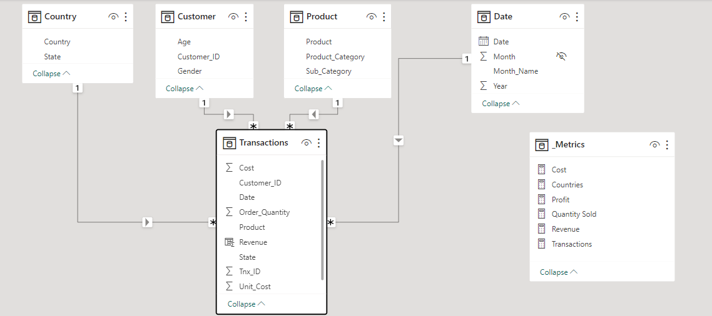
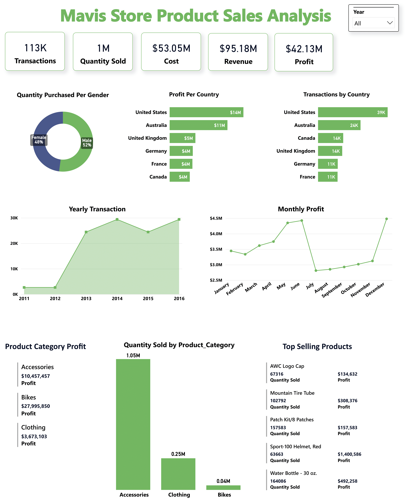
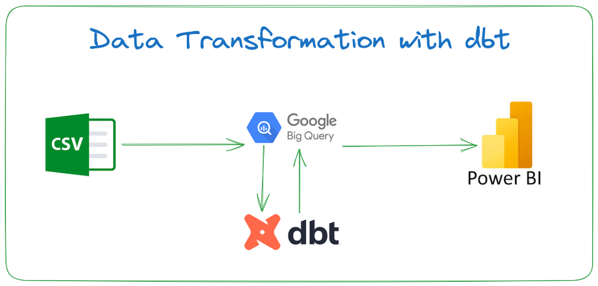

## Data Transformation with dbt

 

This project details how data transformation can be done using dbt: a tool for data transformation. The dataset consists of sales record for a ficticious store called **Mavin Store**. 

As part of the data transformation process, dimensional data models was created

## Dimensional Modelling

## Visualization

## Data Architecture

## Data Pipeline
1. Load CSV data file into Google Bigquery
2. Connect dbt to Google Bigquery to perform data transformation and create data models
3. Load transformed data back into Google Bigquery
4. Connect Power BI to Google Bigquery and create stunning visualization

 

## Using the project
Load the project into your development environment, open your terminal

Run the following commands:
- dbt debug -> Test that the project is working properly and devoid of errors
- dbt run -> Run the data models and load them into data warehouse
- dbt test -> Run tests

# To-Do's
dbt Data Documentation

## Lessons Learnt
Successfully connecting dbt to a designated data warehouse, performing transformations and creating fact and dimension data models